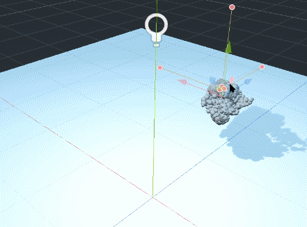
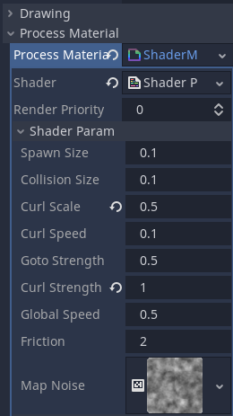
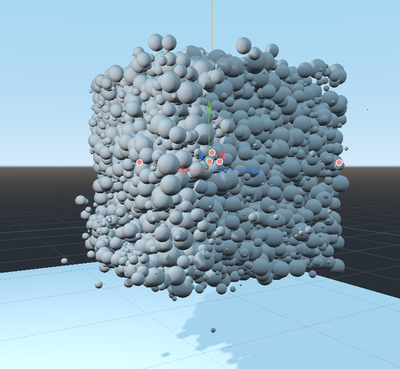

# Particles

## GPU particles template in Godot engine.



### Particles simulation with basic force fields rules.



### Billboard shader with sphere impostor.



### Particles shader preview

```glsl
shader_type particles;

uniform float spawn_size = 0.1;
uniform float collision_size = 0.1;
uniform float curl_scale = 0.1;
uniform float curl_speed = 0.1;
uniform float goto_strength = 0.5;
uniform float curl_strength = 0.5;
uniform float global_speed = 0.5;
uniform float friction = 2.0;
uniform sampler2D map_noise;

// Dave Hoskins https://www.shadertoy.com/view/4djSRW
vec3 hash31(float p)
{
    vec3 p3 = fract(vec3(p) * vec3(.1031, .1030, .0973));
    p3 += dot(p3, p3.yzx+33.33);
    return fract((p3.xxy+p3.yzz)*p3.zyx);
}

void vertex()
{
    vec3 rng = hash31(float(INDEX))_2.-1.;
    vec3 origin = (EMISSION_TRANSFORM _ vec4(rng _ spawn_size,1)).xyz;
    if (RESTART)
    {
        // spawn
        TRANSFORM[3].xyz = origin;

        // reset data
        CUSTOM.w = 0.0;
    }
    else
    {
        // lifetime
        float lifetime = fract(CUSTOM.w);

        // go to target
        float dist_origin = length(TRANSFORM[3].xyz - origin);
        dist_origin = smoothstep(0.01, 0.1, dist_origin);
        vec3 goto_origin = vec3(0);
        if (dist_origin > 0.0)
        {
            goto_origin = normalize(origin - TRANSFORM[3].xyz);
        }

        // curl noise
        vec3 uv = TRANSFORM[3].xyz _ curl_scale;
        uv += TIME _ curl_speed;
        vec3 curl = vec3(
            textureLod(map_noise, uv.xz, 0.).r,
            textureLod(map_noise, uv.xy, 0.).r,
            textureLod(map_noise, uv.zy, 0.).r
        ) _ 2. - 1.;

        // friction
        VELOCITY _= 1. - DELTA _ friction;

        // velocity
        VELOCITY += curl _ curl_strength _ (dist_origin + 0.1) _ global_speed;
        VELOCITY += goto_origin _ goto_strength _ dist_origin _ global_speed;

        // floor collision
        if (TRANSFORM[3].y < 0.) VELOCITY.y = 0.;
        TRANSFORM[3].y = max(collision_size, TRANSFORM[3].y);

        // lifetime
        CUSTOM.w += DELTA / LIFETIME;
    }
}
```

### Particles and spatial shaders manuals.

https://docs.godotengine.org/en/stable/tutorials/shaders/shader_reference/particle_shader.html
https://docs.godotengine.org/en/stable/tutorials/shaders/shader_reference/spatial_shader.html
